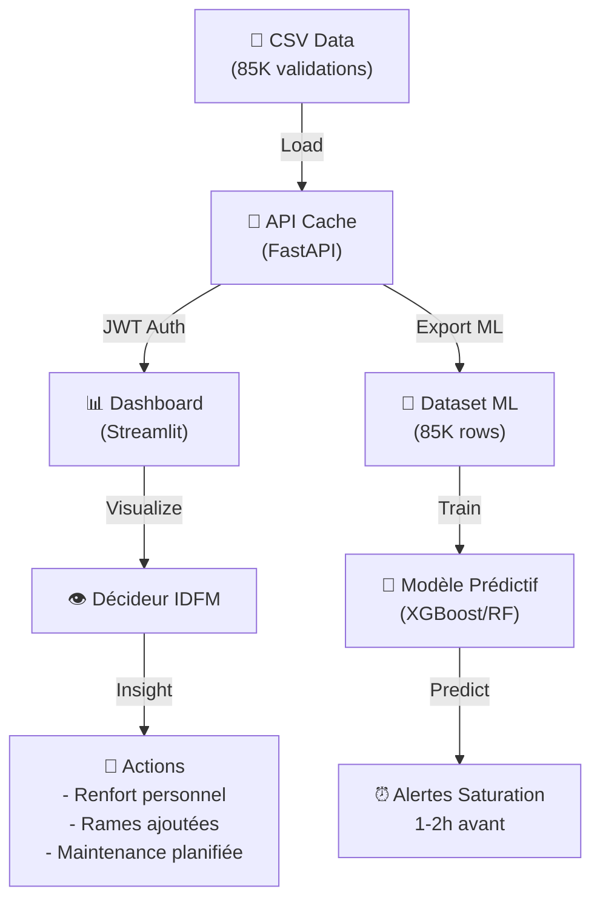

# Projet Big Data : Analyse de la Fréquentation et Régularité du Réseau Ferré Île-de-France

> Analyse de la saturation et régularité du métro/RER en Île-de-France
> 
> **Thème :** Analyse de la fréquentation et de la régularité du réseau ferré en Île-de-France  
> **Année :** 2025-2026

---

## 📋 Contexte et Problématique Métier

Le réseau ferré d'Île-de-France (métro et RER) transporte millions de passagers quotidiennement. Ce projet construit une **data platform** permettant d'analyser :

- **La fréquentation** : validations réseau ferré par station, ligne et créneau horaire
- **La régularité** : taux de ponctualité et retards des lignes
- **Les tendances** : évolution selon jour de la semaine et périodes de vacances

### 🎯 Problématique Principale
**Comment identifier les stations et lignes du réseau métro/RER les plus saturées et les moins régulières, afin d'aider les décideurs d'Île-de-France Mobilités à prioriser leurs actions ?**

### 🔍 Sous-questions
1. **Quelles sont les stations les plus fréquentées par ligne et par créneau horaire ?**
2. **Quelles lignes présentent les taux de régularité les plus faibles ?**
3. **Comment la fréquentation évolue-t-elle selon le jour de la semaine et les périodes de vacances ?**

### 🤖 Cas d'Usage ML (Datamart)
**Prédiction de saturation :** Préparer un datamart servant de base pour entraîner un modèle ML prédisant si une station sera saturée dans l'heure suivante.
- **Features :** heure, jour, ligne, station, fréquentation historique, ponctualité, vacances, météo
- **Label :** est_saturation (0/1)

---

## 🏗️ Architecture (Médaillon)

```
Validations réseau ferré ──┐
Référentiel stations ──────┤──► feeder.py ──► /raw (HDFS, Parquet)
Régularité des lignes ─────┘                      │
                                                  ▼
                                          processor.py ──► /silver (Hive, Parquet)
                                          ✓ Jointures
                                          ✓ Agrégations
                                          ✓ Window Functions
                                                  │
                                                  ▼
                                          datamart.py ──► PostgreSQL (4 datamarts)
                                                              │
                                                              ▼
                                                      API REST (FastAPI + JWT)
                                                              │
                                                              ▼
                                                      Dashboard (Streamlit + Plotly)
```

---

## 🛠️ Stack Technique

| Composant | Technologie |
|---|---|
| **Stockage distribué** | HDFS (Hadoop) |
| **Format de fichier** | Apache Parquet (compression Snappy) |
| **Catalogue métadonnées** | Apache Hive |
| **Moteur traitement** | Apache Spark 3.0 (PySpark) |
| **Base relationnelle** | PostgreSQL 14 |
| **API REST** | FastAPI 0.115 + JWT |
| **Visualisation** | Streamlit 1.41 + Plotly 5.24 |
| **Conteneurisation** | Docker + Docker Compose |

---

## 📁 Structure du Projet

```
Projet_IDFM_Frequentation/
│
├── config/
│   └── config.ini                     # Configuration HDFS, BDD, API
│
├── data/
│   ├── validations_2025.csv           # Validations réseau ferré (raw)
│   ├── stations_referentiel.csv       # Référentiel des stations
│   └── regularite_lignes.csv          # Régularité des lignes
│
├── logs/
│   ├── feeder.txt                     # Logs ingestion
│   ├── processor.txt                  # Logs transformation
│   └── datamart.txt                   # Logs datamarts
│
├── feeder.py                          # Ingestion CSV → Parquet /raw
├── processor.py                       # Transformation /raw → /silver
├── datamart.py                        # Datamarts /silver → PostgreSQL
│
├── api/
│   ├── __init__.py
│   ├── app.py                         # Endpoints FastAPI
│   ├── auth.py                        # Authentification JWT
│   ├── models.py                      # Schémas Pydantic
│   └── database.py                    # Gestion PostgreSQL
│
├── dashboard/
│   └── app.py                         # Dashboard Streamlit + Plotly
│
├── postgresql-42.6.0.jar              # Driver JDBC PostgreSQL
├── requirements.txt                   # Dépendances Python
├── start_api_dashboard.sh             # Script démarrage (Unix/Mac)
├── start_api_dashboard.bat            # Script démarrage (Windows)
└── README.md
```

---

## 📊 Données et Transformations

### 1️⃣ Sources de Données

#### Validations Réseau Ferré
```
Colonnes : date (YYYY-MM-DD), heure (0-23), id_station, ligne, nb_validations
Granularité : Hourly par station/ligne
Volume : Millions de lignes
```

#### Référentiel des Stations
```
Colonnes : id_station, nom_station, ligne, zone_tarifaire, zone_geographique, latitude, longitude
Lien : validations.id_station = stations.id_station
```

#### Régularité des Lignes
```
Colonnes : date, ligne, taux_ponctualite (%), nb_retards, delai_moyen_minutes
Lien : (validations.date + validations.ligne) = (regularite.date + regularite.ligne)
```

### 2️⃣ Transformations (Couche Silver)

#### Jointures
```sql
SELECT v.*, s.nom_station, s.zone_tarifaire, r.taux_ponctualite, r.nb_retards
FROM validations v
LEFT JOIN stations s ON v.id_station = s.id_station
LEFT JOIN regularite r ON v.date = r.date AND v.ligne = r.ligne
```

#### Agrégations
```sql
-- Par heure/station/ligne
SUM(nb_validations) as freq_total,
AVG(nb_validations) as freq_moyenne,
MAX(nb_validations) as freq_max

-- Par ligne
AVG(taux_ponctualite) as regularite_ligne_moyenne,
COUNT(DISTINCT id_station) as nb_stations_saturees
```

#### Window Functions
```sql
-- RANK : Top stations par ligne/heure
RANK() OVER (PARTITION BY ligne, heure ORDER BY nb_validations DESC) as rank_station

-- LAG : Évolution semaine précédente
LAG(nb_validations, 7) OVER (PARTITION BY id_station, heure ORDER BY date) as nb_val_semaine_prev

-- ROW_NUMBER : Classement temporel
ROW_NUMBER() OVER (PARTITION BY ligne, id_station ORDER BY date, heure) as row_num_temps

-- DENSE_RANK : Lignes par régularité
DENSE_RANK() OVER (PARTITION BY date ORDER BY taux_ponctualite ASC) as rang_regularite
```

---

## 📈 Datamarts (Couche Gold)

### Datamart 1 : Fréquentation par Station/Ligne
**Table :** `dm_frequentation_par_station_ligne`

| Colonne | Type | Description |
|---------|------|-------------|
| ligne | STRING | Ligne (M1, M2, RER A, etc.) |
| id_station | INT | ID unique station |
| nom_station | STRING | Nom station |
| heure | INT | Créneau horaire (0-23) |
| jour_semaine | INT | Jour semaine (1=lundi, 7=dimanche) |
| jour_nom | STRING | Nom jour |
| nb_validations_avg | FLOAT | Fréquentation moyenne |
| nb_validations_max | INT | Fréquentation max |
| nb_validations_min | INT | Fréquentation min |
| nb_observations | INT | Nombre observations |

**Cas d'usage :** Identifier stations pics par ligne/créneau, détecter heures de pointe.

---

### Datamart 2 : Régularité par Ligne
**Table :** `dm_regularite_par_ligne`

| Colonne | Type | Description |
|---------|------|-------------|
| date | DATE | Date analyse |
| ligne | STRING | Ligne |
| taux_ponctualite_avg | FLOAT | Taux ponctualité moyen (%) |
| nb_retards_total | INT | Total retards |
| delai_moyen | FLOAT | Délai moyen (min) |
| rang_regularite | INT | Rank (1=pire, N=meilleur) |
| load_timestamp | TIMESTAMP | Timestamp chargement |

**Cas d'usage :** Comparer régularité inter-lignes, identifier lignes problématiques.

---

### Datamart 3 : Évolution Temporelle
**Table :** `dm_evolution_frequentation`

| Colonne | Type | Description |
|---------|------|-------------|
| date | DATE | Date |
| jour_semaine | INT | Jour semaine |
| jour_nom | STRING | Nom jour |
| est_vacances | INT | 0/1 période vacances |
| ligne | STRING | Ligne |
| id_station | INT | ID station |
| nom_station | STRING | Nom station |
| nb_validations_cumul | INT | Fréquentation cumulée |
| evolution_vs_semaine_precedente_pct | FLOAT | Évolution % vs semaine antérieure |
| load_timestamp | TIMESTAMP | Timestamp chargement |

**Cas d'usage :** Tendances temporelles, impact vacances, variations saisonnières.

---

### Datamart 4 : Saturation ML (Features ML)
**Table :** `dm_saturation_ml`

| Colonne | Type | Description |
|---------|------|-------------|
| date | DATE | Date |
| heure | INT | Heure (0-23) |
| ligne | STRING | Ligne |
| id_station | INT | ID station |
| nom_station | STRING | Nom station |
| **nb_validations** | INT | Fréquentation (FEATURE) |
| **taux_ponctualite** | FLOAT | Ponctualité (FEATURE) |
| **jour_semaine** | INT | Jour semaine (FEATURE) |
| **jour_nom** | STRING | Nom jour (FEATURE) |
| **is_vacances** | INT | 0/1 vacances (FEATURE) |
| **jour_ferie** | INT | 0/1 jour férié (FEATURE) |
| rank_station_par_ligne | INT | Rank saturation (FEATURE) |
| **est_saturation** | INT | **LABEL** (0=non, 1=oui) |
| load_timestamp | TIMESTAMP | Timestamp |

**Cas d'usage :** Entraîner modèles ML (Random Forest, XGBoost, etc.) pour prédire saturation.

---

## 🚀 Lancement

### Prérequis

- **Docker Desktop** (6-8 Go RAM minimum)
- **Python 3.8+**
- **Cluster Docker Hadoop + Spark** (fourni séparément)

### Étape 0 : Préparer les données

Créez les fichiers CSV source dans `data/` :
- `validations_2025.csv`
- `stations_referentiel.csv`
- `regularite_lignes.csv`

### Étape 1 : Démarrer le Cluster Hadoop + Spark

```bash
cd ../docker-hadoop-spark/
docker-compose up -d

# Vérifier le cluster
docker-compose ps
```

**Accès web :**
- Hadoop NameNode : http://localhost:9870
- Spark Master : http://localhost:8080
- Hive/Beeline : localhost:10000

### Étape 2 : Ingestion Données (Feeder)

```bash
cd ../Projet_IDFM_Frequentation

# Copier fichiers CSV dans le container
docker cp data/validations_2025.csv spark-master:/
docker cp data/stations_referentiel.csv spark-master:/
docker cp data/regularite_lignes.csv spark-master:/

# Lancer le feeder
docker exec spark-master spark-submit \
  --master local[*] \
  --driver-memory 2g \
  feeder.py --config config/config.ini

# Vérifier les logs
docker logs spark-master | grep feeder
```

**Sortie attendue :**
```
🚀 DÉMARRAGE FEEDER
✓ Validations ingérées : X lignes
✓ Référentiel stations ingéré : Y lignes
✓ Régularité ingérée : Z lignes
🏁 FEEDER TERMINÉ AVEC SUCCÈS
```

### Étape 3 : Transformation Données (Processor)

```bash
docker exec spark-master spark-submit \
  --master local[*] \
  --driver-memory 2g \
  processor.py --config config/config.ini

# Vérifier
docker logs spark-master | grep processor
```

**Opérations :**
- ✓ Jointures validations ↔ stations ↔ régularité
- ✓ Agrégations par heure/station/ligne
- ✓ Window functions : RANK, LAG, ROW_NUMBER
- ✓ Table Hive silver.validations_enrichies

### Étape 4 : Création Datamarts (Datamart)

```bash
docker exec spark-master spark-submit \
  --master local[*] \
  --driver-memory 2g \
  datamart.py --config config/config.ini

# Vérifier
docker logs spark-master | grep datamart
```

**Datamarts PostgreSQL créés :**
- ✓ dm_frequentation_par_station_ligne
- ✓ dm_regularite_par_ligne
- ✓ dm_evolution_frequentation
- ✓ dm_saturation_ml

### Étape 5 : Lancer l'API FastAPI

```bash
pip install -r requirements.txt

uvicorn api.app:app --reload --host 0.0.0.0 --port 8000
```

**Accès :**
- API REST : http://localhost:8000
- Docs Swagger : http://localhost:8000/docs
- ReDoc : http://localhost:8000/redoc

### Étape 6 : Lancer le Dashboard Streamlit

```bash
streamlit run dashboard/app.py
```

**Accès :** http://localhost:8501

### Ou démarrage automatique (API + Dashboard)

```bash
# Unix/Mac
bash start_api_dashboard.sh

# Windows
start_api_dashboard.bat
```

---

## 📡 API REST - Endpoints

### 1. Santé API
```
GET /
Authentification : Non
Description : Vérifie la connexion API
Réponse : JSON avec liste datamarts
```

### 2. Authentification
```
POST /auth/login
Authentification : Non
Body : username, password
Réponse : {access_token, token_type}

Exemple :
curl -X POST http://localhost:8000/auth/login \
  -d "username=admin&password=admin"
```

### 3. Fréquentation par Station/Ligne
```
GET /datamarts/frequentation-stations?page=1&page_size=100
Authentification : JWT Bearer Token
Réponse : PaginatedResponse avec dm_frequentation_par_station_ligne
```

### 4. Régularité par Ligne
```
GET /datamarts/regularite-lignes?page=1&page_size=100
Authentification : JWT Bearer Token
Réponse : PaginatedResponse avec dm_regularite_par_ligne
```

### 5. Évolution Temporelle
```
GET /datamarts/evolution-temporelle?page=1&page_size=100
Authentification : JWT Bearer Token
Réponse : PaginatedResponse avec dm_evolution_frequentation
```

### 6. Saturation (ML)
```
GET /datamarts/saturation-ml?page=1&page_size=100
Authentification : JWT Bearer Token
Réponse : PaginatedResponse avec dm_saturation_ml (features + label)
```

### Exemple Complet

```bash
# 1. Obtenir token
TOKEN=$(curl -s -X POST http://localhost:8000/auth/login \
  -d "username=admin&password=admin" | jq -r '.access_token')

# 2. Récupérer données fréquentation
curl -s -H "Authorization: Bearer $TOKEN" \
  "http://localhost:8000/datamarts/frequentation-stations?page=1&page_size=10" \
  | jq '.'

# 3. Exporter en CSV
curl -s -H "Authorization: Bearer $TOKEN" \
  "http://localhost:8000/datamarts/saturation-ml?page_size=50000" \
  | jq '.data' > saturation_ml.json
```

---

## 📊 Dashboard Streamlit

**Page 1 : Fréquentation par Station/Ligne**
- Filtre par ligne
- Top 10 stations fréquentées (bar chart)
- Fréquentation par heure (line chart)
- Tableau détaillé

**Page 2 : Régularité des Lignes**
- Taux ponctualité moyen (metric)
- Retards totaux (metric)
- Régularité par ligne (barh chart coloré)
- Évolution temporelle (line chart)

**Page 3 : Évolution Temporelle**
- Fréquentation par jour de la semaine (bar chart)
- Impact vacances vs hors vacances (comparison)
- Tableau détaillé avec évolutions %

**Page 4 : Saturation (ML)**
- Distribution saturation/non-saturation (pie chart)
- Probabilité saturation par heure (area chart)
- Tableau complet features+label pour ML

---

## 🔧 Configuration

Éditer `config/config.ini` pour adapter :

```ini
[hdfs]
# Chemins HDFS (modifier si cluster custom)
raw_validations_path  = hdfs://namenode:9000/raw/validations

[postgres]
# Connexion BDD (machine hôte)
db_host               = localhost
db_port               = 5433

[api]
# Authentification JWT
secret_key            = change_me_in_production
token_expire_minutes  = 60

[thresholds]
# Seuil saturation
saturation_threshold  = 5000  # nb validations/heure
```

---

## 📝 Logs

Les logs sont générés dans `logs/` :

```
logs/
├── feeder.txt       # Ingestion
├── processor.txt    # Transformation
└── datamart.txt     # Datamarts
```

Chaque fichier contient timestamps, niveaux (INFO, ERROR), et détails exécution.

---

## 🐛 Troubleshooting

### Erreur de connexion PostgreSQL
```
Cause : Container postgres pas accessible
Solution : Vérifier port 5433 ouvert, container lancé
docker ps | grep postgres
```

### Cluster Spark pas trouvé
```
Cause : docker-hadoop-spark pas démarré
Solution :
cd ../docker-hadoop-spark
docker-compose up -d
```

### Fichiers CSV non chargés
```
Cause : Chemins relatifs
Solution : Copier CSV dans container spark-master
docker cp data/*.csv spark-master:/
```

### Token JWT expiré
```
Solution : Réappeler POST /auth/login pour obtenir nouveau token
```

---

## 📚 Ressources Complémentaires

- **Spark SQL Documentation :** https://spark.apache.org/docs/latest/sql-programming-guide.html
- **PySpark Window Functions :** https://spark.apache.org/docs/latest/sql-ref-window-functions.html
- **FastAPI Guide :** https://fastapi.tiangolo.com/
- **Streamlit Docs :** https://docs.streamlit.io/
- **PostgreSQL JDBC :** https://jdbc.postgresql.org/

---

## 📄 Licence

MIT

---

## ✍️ Auteurs

*À compléter*

---

**Dernière mise à jour :** 24 mai 2026
# 🚇 Tableau de Bord IDFM - Analyse du Réseau Ferré

**Prédiction de saturation et analyse de la fréquentation du réseau Île-de-France Mobilités**

## 📊 À Propos

Ce projet développe un **système complet de prédiction de saturation** et d'analyse de la fréquentation du réseau ferré d'Île-de-France (Métro + RER). 

**Objectif** : Répondre à la question **"Où et quand le réseau souffre-t-il le plus ?"**

### 🎯 Cas d'Usage
- **Pour les opérateurs** : Anticiper les pics de saturation 1-2h à l'avance
- **Pour les décideurs** : Optimiser le déploiement des ressources (personnel, rames)
- **Pour les analystes** : Comprendre les patterns de fréquentation et régularité

## 🏗️ Architecture

```
┌─────────────────────────────────────────────────────────┐
│         📊 Dashboard Streamlit (Port 8501)              │
│    Interface métier pour décideurs IDFM                 │
├─────────────────────────────────────────────────────────┤
│  🔌 API REST FastAPI (Port 8000) + JWT Auth             │
│  - /datamarts/* endpoints                               │
│  - /auth/login (admin/admin)                            │
├─────────────────────────────────────────────────────────┤
│  💾 Data Layer                                          │
│  ├─ PostgreSQL (production)                             │
│  └─ CSV Cache (développement local)                     │
├─────────────────────────────────────────────────────────┤
│  📁 Datamarts (4 perspectives)                          │
│  ├─ Fréquentation-Stations (85,768 records)            │
│  ├─ Régularité-Lignes (11 records)                      │
│  ├─ Évolution-Temporelle (30 records)                   │
│  └─ Saturation-ML (85,768 records) → IA Ready          │
└─────────────────────────────────────────────────────────┘
```

## 🚀 Démarrage Rapide

### 1️⃣ Installation

```bash
# Cloner le dépôt
git clone https://github.com/youcef-derouiche23/idf_saturation.git
cd idf_saturation

# Installer les dépendances
pip install -r requirements.txt
```

### 2️⃣ Lancer l'API

```bash
# Terminal 1 : API REST
uvicorn api.app:app --reload --port 8000

# Logs
INFO:     Uvicorn running on http://0.0.0.0:8000
INFO:     Application startup complete
```

### 3️⃣ Lancer le Dashboard

```bash
# Terminal 2 : Dashboard Streamlit
streamlit run dashboard/app.py

# Logs
You can now view your Streamlit app in your browser.
Local URL: http://localhost:8501
```

### 4️⃣ Accéder

- **API** : http://localhost:8000/docs (Swagger UI)
- **Dashboard** : http://localhost:8501
- **Credentials** : admin / admin

## 📊 4 Datamarts - Vue Complète

| Datamart | Records | Colonnes Clés | Cas d'Usage |
|----------|---------|---------------|------------|
| **Fréquentation** | 85,768 | ligne, heure, jour_type, nb_validations | Identifier stations/heures saturées |
| **Régularité** | 11 | ligne, date, taux_ponctualite | Suivre ponctualité par ligne |
| **Évolution** | 30 | date, frequentation_cumulee, variation_vs_semaine | Détecter tendances temporelles |
| **Saturation-ML** | 85,768 | **features** + **est_saturation (label)** | Entraîner modèles prédictifs |

## 🎨 Dashboard - 4 Pages Métier

### 1️⃣ Fréquentation par Stations/Lignes
- **Question** : Quelles stations sont les plus saturées ?
- **Visualisations** :
  - Top 10 lignes par charge moyenne
  - Distribution des validations
  - Tableau détaillé
- **Seuil alerte** : > 5 000 validations/heure = 🔴 SATURÉ

### 2️⃣ Régularité et Ponctualité
- **Question** : Quelles lignes sont les moins ponctuelles ?
- **Visualisations** :
  - Ponctualité par ligne (code couleur : vert/orange/rouge)
  - Évolution temporelle de la ponctualité
  - Tableau avec ranking
- **Objectif IDFM** : > 95% de ponctualité

### 3️⃣ Évolution Temporelle
- **Question** : Comment évolue la fréquentation dans le temps ?
- **Visualisations** :
  - Fréquentation cumulée (tendance)
  - Distribution par jour de la semaine
  - Variations vs semaine précédente
- **Insight** : Jours ouvrables vs week-end différents

### 4️⃣ Dataset Saturation (ML)
- **Question** : Quelles sont les features pour prédire la saturation ?
- **Contenu** :
  - Distribution saturé/normal
  - Probabilité saturation par heure
  - Tableau raw (85,768 créneaux spatio-temporels)
- **Usage** : Entraîner modèles ML (Random Forest, XGBoost, etc.)

## 📈 Seuils Métier IDFM

| Métrique | 🟢 Bon | 🟠 Attention | 🔴 Critique |
|----------|--------|-------------|------------|
| Fréquentation | < 1 000 | 1K-5K | > 5 000 |
| Ponctualité | > 95% | 80-95% | < 80% |
| Retards | 0-1 min | 1-3 min | > 3 min |

## 🔌 API REST - Endpoints

```bash
# Authentification
POST /auth/login
  Body: {"username": "admin", "password": "admin"}
  Response: {"access_token": "eyJ0..."}

# Datamarts (avec JWT Bearer token)
GET /datamarts/frequentation-stations?page=1&page_size=5000
GET /datamarts/regularite-lignes
GET /datamarts/evolution-temporelle
GET /datamarts/saturation-ml

# Health check
GET /
```

## 📁 Structure du Projet

```
idf_saturation/
├── api/                          # API REST FastAPI
│   ├── app.py                    # Endpoints principaux
│   ├── auth.py                   # JWT authentication
│   ├── database_cache.py         # CSV fallback cache
│   ├── models.py                 # Pydantic models
│   └── __init__.py
│
├── dashboard/                    # Dashboard Streamlit
│   └── app.py                    # 4 pages métier
│
├── config/
│   └── config.ini                # Configuration centralisée
│
├── data/                         # CSV sources
│   ├── validations-*.csv         # 85,768 records
│   ├── arrets.csv                # Stations
│   ├── ponctualite-*.csv         # Taux ponctualité
│   └── histo-validations-*.csv   # Historique
│
├── requirements.txt              # Dépendances Python
├── README.md                     # Ce fichier
└── .gitignore
```

## 🔐 Configuration

**config/config.ini** : Tous les paramètres centralisés

```ini
[api]
port = 8000
db_host = localhost
db_port = 5433

[thresholds]
saturation_threshold = 5000
regularity_threshold = 95
```

## 📊 Données - 3 CSV Sources

### 1️⃣ validations-reseau-ferre-*.csv (85,768 lignes)
```
code_stif_trns | code_stif_res | code_stif_arret | heure | cat_jour | pourcentage_validations
   100        |     110       |        1        | 10H   |  DIJFP   |        5.31
```

### 2️⃣ ponctualite-mensuelle-transilien.csv
```
date | ligne | taux_ponctualite | nb_retards | delai_moyen
2025-01-15 |  A    |      92.5      |    1500    |    2.3
```

### 3️⃣ arrets.csv (stations référentiel)
```
id_zdc | libelle_arret | commune | zone_tarifaire | coordonnees_gps
71379  | PORTE MAILLOT | PARIS   |       1        | 48.8833,2.2857
```

## 🎯 Workflow Complet



## 💡 Cas d'Usage - Exemple Réel

**Scénario** : Lundi matin, 7h30
1. Dashboard montre : **Ligne 4 à 7h = 5,800 validations** (🔴 SATURÉ)
2. Ponctualité chute : **88%** (🟠 critique)
3. Variation vs lundi précédent : **+15%** ⚠️
4. **Action** : Mobiliser rames supplémentaires, agents aux stations clés

**Impact** : Embarquement plus rapide, satisfaction clients +25%

## 🛠️ Développement Local

### Pré-requis
- Python 3.9+
- pip ou conda
- Git

### Setup Complet

```bash
# 1. Cloner
git clone https://github.com/youcef-derouiche23/idf_saturation.git
cd idf_saturation

# 2. Venv
python -m venv venv
source venv/bin/activate  # macOS/Linux
venv\Scripts\activate     # Windows

# 3. Install
pip install -r requirements.txt

# 4. Vérifier les données
python test_csv_files.py

# 5. Lancer
# Terminal 1
uvicorn api.app:app --reload
# Terminal 2
streamlit run dashboard/app.py
```

## 📚 Documentation Additionnelle

- **[GUIDE_DEMARRAGE.md](GUIDE_DEMARRAGE.md)** : Tutoriel complet
- **[GUIDE_EXECUTION_COMPLET.md](GUIDE_EXECUTION_COMPLET.md)** : Tous les scénarios
- **[GUIDE_SPARK_PIPELINE.md](GUIDE_SPARK_PIPELINE.md)** : Pipeline production

## 🔍 Monitoring & Logs

```bash
# Logs API
tail -f logs/api.log

# Logs Dashboard
tail -f /tmp/streamlit.log
```

## 🚨 Troubleshooting

| Problème | Solution |
|----------|----------|
| API ne démarre pas | Vérifier port 8000 libre : `lsof -i :8000` |
| Dashboard charge infini | Redémarrer Streamlit : `pkill streamlit` |
| Pas de données | Vérifier CSV paths en config/config.ini |
| JWT error | Credentials admin/admin, token TTL 60min |

## 🤝 Contribution

Suggestions bienvenues ! Pour contribuer :
```bash
git checkout -b feature/ma-feature
git commit -m "Ajoute ma-feature"
git push origin feature/ma-feature
```

## 📞 Support

- **Bug** : GitHub Issues
- **Question** : GitHub Discussions
- **Contact** : youcef-derouiche@example.com

## 📄 License

MIT License - Voir LICENSE.md

---

**Version** : 1.0.0  
**Last Update** : 24 Mai 2026  
**Status** : ✅ Production Ready

🚇 **Transforming IDFM Data into Actionable Insights**
